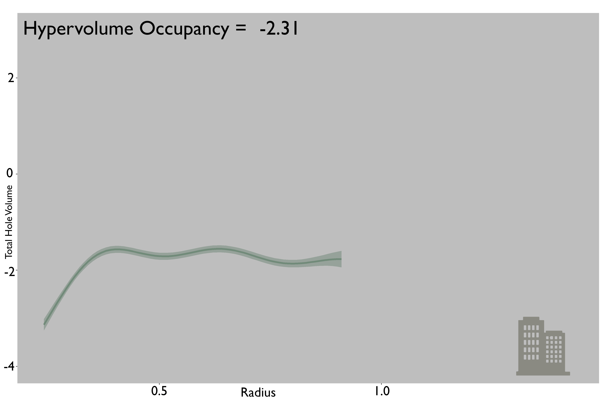

## Analysis of the impacts of land use on the internal structure of avian functional trait space

This markdown re-visits the hole analysis that was somewhat abandoned in the first pass. The goal was to capture changes in the internal structure of trait spaces, which traditional methods and approaches aren't typically able to do so. To reveal such impacts I aim to detect "hole" within the bounds of a convex hull surrounding the observed hypervolumes. I defined holes in an analougous way to Blonder by encasing the observed hypervolume in an convex hull and then comparing the trait space to a "baseline" condition. Where we differ is that my baseline is defined as a null expectation contingent on the observed hypervolumes regional species pool, as opposed to all unoccupied trait space being considered a "hole". Another difference can be seen in the clustering approach to group empty space into distinct "holes". Blonder uses distance based clustering approaches, which is poor for detecting non-circular holes. I using density based clustering which defines holes based on the number of points within a minimum distance to each point. To accont for the sensitivity of hole detection to this minimum distance I create hole profiles calculating the number of holes and their size as this radius increases. 

Intuitively, one would expect that bird communities in land uses of increasing human influence would display a greater erosion of their internal trait space, but we will see what we capture. 


```{r setup, include=FALSE}
knitr::opts_chunk$set(echo = TRUE)
```

## Load in data, packages and functions

```{r cars}

rm(list = ls())

require(mgcv) ## to perform GAMs
require(tidyverse) ## for data  wrangling and piping
require(lme4)
require(emmeans)
library(lmerTest)


source("../Functions/TPD_3D_plots.R") ## my very own TPD functions


PREDICTS_tpds <-
  readRDS("../Outputs/PREDICTS_sites_tpds.rds") # morphometric TPDs of observed sites

PREDICTS_randomisations <-
  readRDS("../Outputs/randomisations_TPD_morpho.rds") ## morphometric TPD of randomisised sites


PREDICTS_full <- readRDS("../Outputs/refined_predicts.rds")

PREDICTS <- PREDICTS_full %>%  ## PREDICTS data
  dplyr::distinct(SSBS, Predominant_habitat, Realm, SS,Location,Biome) %>% ## pull out land_use type, Subregion, realm etc
  dplyr::mutate(
    Predominant_habitat = ifelse(
      grepl(
        Predominant_habitat,
        pattern = "secondary",
        ignore.case = TRUE
      ),
      "Secondary vegetation",
      paste(Predominant_habitat)
    ),Predominant_habitat = ifelse(
      grepl(
        Predominant_habitat,
        pattern = "primary forest",
        ignore.case = TRUE
      ),
      "Primary vegetation",
      paste(Predominant_habitat))
  ) %>% dplyr::filter(Predominant_habitat != "Primary non-forest") %>%
  #dplyr::filter(!(!grepl(Biome, pattern = "forest",ignore.case = TRUE) & grepl(Predominant_habitat, pattern = "vegetation"))) %>% 
  data.frame() ## merge all secondary sites together


TPD_land_uses <-
  data.frame(SSBS = names(PREDICTS_tpds)) %>% dplyr::left_join(PREDICTS, by = "SSBS") %>% dplyr::filter(Predominant_habitat != "Cannot decide")
### check a table
table(TPD_land_uses$Predominant_habitat, TPD_land_uses$Realm)


land_uses <-
  c(
    "Primary vegetation",
    "Secondary vegetation",
    "Plantation forest",
    "Pasture",
    "Cropland",
    "Urban"
  )
realms <-
  c("Neotropic",
    "Afrotropic",
    "Palearctic",
    "Nearctic",
    "Australasia",
    "Indo-Malay")


land_use_colours <-
  data.frame(
    land_use = land_uses,
    colours = c(
      "chartreuse4",
      "olivedrab2",
       "springgreen2",
      "#EBF787",
      "#E3D438",
      "#718879"
    )
  )
rownames(land_use_colours) <- land_uses
```

## First things first: calculate the hole statistics


This analysis will be based on the Land-Use Realm system hypervolumes to be able to more clearly reveal geomertic patterns, which at the site level is just too noisy and suffers from data limitations.

```{r pressure, echo=FALSE}

if(!any(grepl(list.files("../Outputs/"),pattern = "realm_level_hole_dbscan_forest.rds"))){


realm_level_hole_frame <- c() # Empty data frame

for (land_use in land_uses) {
  for (realm in realms) {
    sites <-
      TPD_land_uses %>% dplyr::filter(Predominant_habitat == land_use, Realm == realm) %>% dplyr::distinct(SSBS) %>% pull()

    if (is_empty(sites)) {
      next()
    }

    LU_holes <-
      TPD_holes(
        data = PREDICTS_tpds,
        randata = PREDICTS_randomisations,
        sites = sites,
        threshold = 0.99,
        minimum_points = 5,
        iteration = 0.1
      )

    hole_data <- LU_holes$internal$metrics_frame

    hole_data$land_use <- land_use
    hole_data$realm <- realm


    realm_level_hole_frame <-
      rbind(realm_level_hole_frame, hole_data)
  }
}

write_rds(file = "../Outputs/realm_level_hole_dbscan_forest.rds", realm_level_hole_frame)
} else {

realm_level_hole_frame <- readRDS("../Outputs/realm_level_hole_dbscan_forest.rds")
}
```


## Trimming things down a little

Now need to exclude some Land-Use Realm hypervolumes that were too data poor to get reliable measures. Also to facilitate modelling I scale some variables.


```{r trimming things down}


realm_level_hole_frame$land_use <-
  factor(
    realm_level_hole_frame$land_use,
    levels = c(
      "Primary vegetation",
      "Secondary vegetation",
      "Plantation forest",
      "Pasture",
      "Cropland",
      "Urban"
    )
  )


modelling_hole_dataframe <-
  realm_level_hole_frame[-which(
    realm_level_hole_frame$land_use == "Urban" &
      realm_level_hole_frame$realm == "Neotropic" |
      realm_level_hole_frame$land_use == "Secondary vegetation" &
      realm_level_hole_frame$realm == "Nearctic" |
      realm_level_hole_frame$land_use == "Plantation forest" &
      realm_level_hole_frame$realm == "Nearctic" |
      realm_level_hole_frame$land_use == "Pasture" &
      realm_level_hole_frame$realm == "Indo-Malay" |
      realm_level_hole_frame$land_use == "Urban" &
      realm_level_hole_frame$realm == "Indo-Malay"|
            realm_level_hole_frame$land_use == "Plantation forest" &
      realm_level_hole_frame$realm == "Australasia"|
            realm_level_hole_frame$land_use == "Cropland" &
      realm_level_hole_frame$realm == "Australasia"
    ), ]


## brilliant this shows that there is no multi-colinearity so good to go ahead with the modelling


volume_boxplot_data <- modelling_hole_dataframe %>% group_by(land_use) %>% dplyr::summarise(hypervolume_occupancy = unique(hypervolume_occupancy))

volume_boxplot_data$land_use <- factor(volume_boxplot_data$land_use, levels = land_uses)

boxy <- ggplot(data = volume_boxplot_data, aes( x = land_use, y = hypervolume_occupancy, group = land_use)) +
  stat_boxplot(geom = "errorbar", size = 0.5,width = 0.3) +
  geom_boxplot(aes(fill = land_use), show.legend = FALSE, size = 1, width = 0.3, outlier.shape = NA ) +
  scale_fill_manual(values = land_use_colours[land_uses, "colours"]) +
  scale_y_continuous(limits = c(0, 20),
                     breaks = c(0, 5, 10,15,20)) +
  theme(panel.background = element_rect(fill = 'white', color = 'white'),
panel.grid.major = element_line(color = 'white'),
panel.grid.minor = element_line(color = "white"),
 axis.title.y = element_blank(),
 axis.text.y = element_blank(),
axis.line = element_line(colour = "black", linetype = "solid"),
 #axis.ticks.y = element_blank(),
    axis.title.x = element_blank(),
  #  axis.ticks.x = element_blank(),
    axis.text.x = element_blank())


plot(boxy)


png(
  filename =
    "../Figures/plots_for_figures/realm_level_boxplot.png",
  width = 300,
  height = 100,
  units = "mm",
  res = 500
)

plot(boxy)
dev.off()


realm_hyper_size <- glm(hypervolume_occupancy ~ land_use, data = volume_boxplot_data )

summary(realm_hyper_size)

```


```{r}
## Let's have a look at the total hole volume


hist(modelling_hole_dataframe$total_hole_volume, breaks = 20)


hist(sqrt(modelling_hole_dataframe$total_hole_volume), breaks = 20)

hist(log(modelling_hole_dataframe$total_hole_volume), breaks = 20)

### out of these three I think the sqrt transformation is the best 


## looks okay let's just scale it to have a standard deviation of 1 and a mean of 0

modelling_hole_dataframe$total_hole_volume <- modelling_hole_dataframe$total_hole_volume


## the size of the observed hypervolume 

hist(scale(modelling_hole_dataframe$hypervolume_occupancy))


## okay maybe could use a transformation


hist(scale(log(modelling_hole_dataframe$hypervolume_occupancy)))


## log probably looks best 


modelling_hole_dataframe$hypervolume_occupancy <- scale(log(modelling_hole_dataframe$hypervolume_occupancy))[,1]


source("https://highstat.com/Books/Book2/HighstatLibV10.R")

corvif(modelling_hole_dataframe[,c("hypervolume_occupancy","land_use", "radius")])


```
## Pre-modelling

Before I start modelling I would like to look at what sort of relationship the variables have with each other, for example the radius of hole detection is not likely to have a linear relationship with total hole volume as it will initially increase sharply with radius but then plateau when all unoccupied space is considered to be part of a hole.

So to have a look at this we 

```{r variable relationships}

### relationship between radius and hole volume 


radius_hole_volume <- ggplot(data = modelling_hole_dataframe, aes(x = radius, y = total_hole_volume, colour = land_use))+
  geom_point() +
  facet_grid(~realm)


plot(radius_hole_volume)


## right this looks non-linear so looking like we are going to need a non-linear modelling approach I'm thinkin generalised linear models (GAMs)


hole_volume_occupancy <- ggplot(data = modelling_hole_dataframe, aes(x = hypervolume_occupancy, y = total_hole_volume, colour = land_use)) +
  geom_point()


plot(hole_volume_occupancy)


## Just looking at the top values here the realtionship is looking a lot more linear with increase observed hypervolume size the larger the observed hole may be.


```
## Modelling


Considering the relationships between the variables I think the model to explore the influence of land use on the internal structure of avian trait space will take the form of...


A generalised additive model (GAM) taking total hole volume as a function of land use, the detection radius of hole as a smoothed variable, observed hypervolume size as a linear variable and the interaction of both with land use.

```{r modelling}


#### lets have a look at a different model structure modelling total hole volume as a function of land use, hypervolume size while taking radius as a random effect
#### 

linear_modelling_dataframe <- modelling_hole_dataframe


## Will need to make radius a factor to indlude as random effect


linear_modelling_dataframe$radius <- factor(linear_modelling_dataframe$radius, ordered = TRUE)


linear_hole_model <- lmer(total_hole_volume ~ land_use + hypervolume_occupancy  +(1|radius), data = linear_modelling_dataframe )


summary(linear_hole_model)
car::Anova(linear_hole_model)

AIC(linear_hole_model)


linear_hole_model_slope <- lmer(total_hole_volume ~ land_use + hypervolume_occupancy + (land_use|radius), data = linear_modelling_dataframe ) 


AIC(linear_hole_model_slope) ## higher AIC


linear_hole_model_slope_2 <- lmer(total_hole_volume ~ land_use + hypervolume_occupancy + (hypervolume_occupancy|radius), data = linear_modelling_dataframe )


AIC(linear_hole_model_slope_2)


summary(linear_hole_model_slope_2)
car::Anova(linear_hole_model_slope_2)

```
## Hole volume summary

This model shows that holes are likely to larger is avian trait spaces of bird communities in all other land uses compared to primary vegetation, significantly so in all land uses other than urban. The size of the observed hypervolume and hole detection radius also have significant effects on the total hole volume, unsurprisingly the larger the observed hypervolume and detection radius the larger the holes. Their interactions with land use are also significant. 

Some interesting interactions going on here with urban holes becoming smaller as observed hypervolume size increases, however observed hypervolume size for urban LURs are all typically very small.

But, lets get some visualisations to aid us in the interpretations of the model. first let's have a look at the effect of the hole detection radius on the total hole volume for each land use. To predict the model I have kept the hypervolume occupancy as the median hypervolume occupancy observed across all viable LUR combinations.


```{r observing lnad use effects}

land_use_plot <- c()

median_volume <- median(unique(modelling_hole_dataframe$hypervolume_occupancy))


for(land_use in land_uses){
  
 # median_volume <- median(unique(modelling_hole_dataframe$hypervolume_occupancy[modelling_hole_dataframe$land_use == land_use]))
    
    
 
  data <- rbind(data.frame(land_use = land_use, fit = predict(linear_hole_model, newdata = data.frame(
                                                                                        land_use = land_use,
                                                                                        hypervolume_occupancy = median_volume), re.form = NA)),
    
  
   data.frame(land_use = "Primary vegetation", fit = predict(linear_hole_model, newdata = data.frame(
                                                                                        land_use = "Primary vegetation",
                                                                                        hypervolume_occupancy = median_volume), re.form = NA)))
  
  
 # data$lower <- data$fit - data$se.fit
#data$upper <- data$fit + data$se.fit

data$fit <- data$fit 

#data$lower <- data$lower / data$fit[data$land_use == "Primary vegetation"]
#data$upper <- data$upper /  data$fit[data$land_use == "Primary vegetation"]


#data$se.fit <- data$se.fit / data$fit[data$land_use == "Primary vegetation"]
data[,2] <- data[,2] / data[data$land_use == "Primary vegetation",2]

  data <- data[-2,]
  
  land_use_plot <- rbind(land_use_plot,data)
  
}


data <- data.frame(land_use = c("Primary vegetation","Secondary vegetation","Plantation forest","Pasture","Cropland","Urban"), hypervolume_occupancy = median_volume)


    
    pred_fun <- function(x) {
      as.numeric(predict(x, newdata = data, re.form = NA))
    }
    
    
    
      
    
      
      
      
      data$estimate <- NA
      data$upper <- NA
      data$lower <- NA
      
      booted_mod <-
        bootMer(
          linear_hole_model,
          FUN = function(x)
            pred_fun(x),
          nsim = 200,seed = 1234
        )


      data$estimate <- booted_mod$t0
bootstraps <- booted_mod$t      
      


  ninety_five_boot <- c()
      
      for (col in 1:ncol(bootstraps)) {
        trim_col <- bootstraps[, col]
        
        trim_col <-
          trim_col[trim_col > as.numeric(quantile(bootstraps[, col], 0)) &
                     trim_col < as.numeric(quantile(bootstraps[, col], 1))]
        
        
        ninety_five_boot <- cbind(ninety_five_boot, trim_col)
        
      }

  ninety_five_boot <- ninety_five_boot/median(ninety_five_boot[,1])
  

  ninety_five_boot <- data.frame(ninety_five_boot)
  
  colnames(ninety_five_boot) <- c("Primary vegetation","Secondary vegetation","Plantation forest","Pasture","Cropland","Urban")
  
  
  
  
  
   boot_plot <-
        ninety_five_boot %>% pivot_longer(cols = colnames(ninety_five_boot), names_to = "land_use")
      
   

boot_plot$land_use <- factor(boot_plot$land_use, levels = land_uses)   
      
   
   realm_size_plot <- ggplot(data = boot_plot, aes(x = land_use, y = value, group = land_use)) +
     geom_violin(aes(colour = land_use, fill = land_use), alpha = 0.5, show.legend = FALSE)+
     geom_boxplot(width = 0.3, aes( fill = land_use), show.legend = FALSE) +
     scale_colour_manual(values = land_use_colours[land_uses, "colours"]) +
     scale_fill_manual(values = land_use_colours[land_uses, "colours"]) +
      scale_y_continuous(limits = c(0.2, 2.2),
                     breaks = c(0.5,1,1.5,2)) +
     theme(panel.background = element_rect(fill = 'white', color = 'white'),
panel.grid.major = element_line(color = 'white'),
panel.grid.minor = element_line(color = 'white'),
  axis.title.y = element_blank(),
    axis.text.y = element_blank(),
    #axis.ticks.y = element_blank(),
    axis.title.x = element_blank(),
axis.line = element_line(colour = "black", linetype = "solid"),
    #axis.ticks.x = element_blank(),
    axis.text.x = element_blank())
  
  
plot(realm_size_plot)  
  


png(
  filename =
    "../Figures/plots_for_figures/realm_level_hole_volume.png",
  width = 200,
  height = 150,
  units = "mm",
  res = 500
)
plot(realm_size_plot)
dev.off()

  
  


```


```{r observing GAM results}


```

This plot looks encouraging that at the median observed hypervolume size that compared to primary vegetation all other land uses are predicted to have larger holes at all hole detection radius values. Interestingly again Urban bird communities are predicted to have the second smallest holes at the median hypervolume occupancy, however, this may not be too unexpected as urban Land-Use Realm systems typically have small observed hypervolume sizes that may be susceptible to functional homogenisation and these results may be indicative of that. 


To get a clearer view of the interaction between land use and radius, and hypervolume occupancy, here is a animation of how the relationship between radius and predicted hole volume differs with different values of inital observed hypervolume size, lines come in when the occupancy is within the range of observed hypervolume occupancy values. One to note is that Urban sites drop out early due to consistently small occupancy values being observed. However, again primary vegetation maintains the smallest holes compared to other land uses irrespective of the oberved hypervolume size.


 

Second visualations will be to show the predictions of hole size with observed hypervolume size. Akin to the other plot I have predicted values iterating through hypervolume size with radius being constant at the median value displayed.


```{r}

gamm_plot_hypervolume_occupancy <- c()


for (land_use in land_uses) {
  #land_use_data <- realm_level_hole_frame_2[realm_level_hole_frame_2$land_use == land_use,"radius"]
  
  hyper_size <-
    range(unique(modelling_hole_dataframe[modelling_hole_dataframe$land_use == land_use, "hypervolume_occupancy"]))
  hyper_size <- seq(hyper_size[1], hyper_size[2], length.out = 100)
  
  
  for (i in hyper_size) {
    
    
    data <- data.frame(
      hypervolume_occupancy = i,
      land_use = land_use,
      fit = predict(
        linear_hole_model,
        newdata = data.frame(
          land_use = land_use,
          hypervolume_occupancy = i
        ),
        re.form = NA
      )
    )
    
    gamm_plot_hypervolume_occupancy <-
      rbind(gamm_plot_hypervolume_occupancy, data)
  }
}


gamm_plot_hypervolume_occupancy$land_use <-
  factor(
    gamm_plot_hypervolume_occupancy$land_use,
    levels = c(
      "Primary vegetation",
      "Secondary vegetation",
      "Plantation forest",
      "Pasture",
      "Cropland",
      "Urban"
    )
  )


hypervolume_hole_plot <-
  ggplot(data = gamm_plot_hypervolume_occupancy, aes(x = hypervolume_occupancy, y = fit, group = land_use)) +
  geom_line(size = 1.5,aes(colour = land_use), show.legend = FALSE) +
  
  #   geom_point(
  #   data = radius_points,
  #   aes(x = hypervolume_occupancy, y = total_hole_volume, colour = land_use)
  #   ,
  #   size = 8,
  #   alpha = 0.6,
  #   show.legend = FALSE
  # ) +
  scale_colour_manual(values = land_use_colours[as.character(unique(gamm_plot_hypervolume_occupancy$land_use)), "colours"]) +
  scale_fill_manual(values = land_use_colours[as.character(unique(gamm_plot_hypervolume_occupancy$land_use)), "colours"]) +
  ylab("Total Hole Volume") +
  xlab("Hypervolume occupancy") +
  theme(panel.background = element_rect(fill = 'white', color = 'white'),
        panel.grid.major = element_line(color = 'white'),
        panel.grid.minor = element_line(color = 'white'))# +
 # ylim(-4,3)+
#  xlim(-3,2)


plot(hypervolume_hole_plot)


```

So again similarly to the radius-hole plot compared to primary vegetation that all other land uses are predicted to have larger holes irrespective of the inital hypervolume size. Predictions are limited by the observed hypervolume size of the Land-Use Realm hypervolumes. 


Next to observed the plots with varying radius values.


Again this shows encouraging results with primary vegetation disaplying consistently smaller holes compared to other land uses.


## Number of hole model

Another indication of the erosion of the internal structure of avian functional trait spaces in human-domianted land uses would be the number of holes displayed while again taking into account the inital hypervolume size and radius of hole detection.


Again this will be a GAM, but this time with a poisson distribution as we are dealing with count data.

``` {r number of hole GAM}

number_of_holes_model <- glmer(number_of_holes ~ hypervolume_occupancy + land_use  + (1|radius), data = realm_level_hole_frame,family = "poisson",control=glmerControl(optimizer="bobyqa", optCtrl=list(maxfun=100000)) )


AIC(number_of_holes_model)


summary(number_of_holes_model)
car::Anova(number_of_holes_model)


number_of_holes_model_slope <- glmer(number_of_holes ~ hypervolume_occupancy + land_use  + (land_use|radius), data = realm_level_hole_frame,family = "poisson",control=glmerControl(optimizer="bobyqa", optCtrl=list(maxfun=100000)) )

AIC(number_of_holes_model_slope)


summary(number_of_holes_model_slope)


number_of_holes_model_slope_2 <- glmer(number_of_holes ~ hypervolume_occupancy + land_use  + (hypervolume_occupancy|radius), data = realm_level_hole_frame,family = "poisson",control=glmerControl(optimizer="bobyqa", optCtrl=list(maxfun=100000)) )


AIC(number_of_holes_model_slope_2)

```

Then additonally, with the number of holes model, compared to primary vegetation bird communities in other land uses typically have a larger number of holes, usually significantly so. However, with the exception of urban communities. However, there is a significant interaction between observed hypervolume size in the opposite direction, which would suggest that the negative overall effect of urban communities is due to the small observed hypervolume size and that they would possibly exhibit a greater number of holes with larger size. 

```{r visualise land_use effect}

land_use_plot <- c()

median_volume <- mean(unique(modelling_hole_dataframe$hypervolume_occupancy))


for(land_use in land_uses){
  
    
    
 
  data <- data.frame(land_use = land_use, fit = predict(number_of_holes_model, newdata = data.frame(
                                                                                        land_use = land_use,
                                                                                        hypervolume_occupancy = median_volume), re.form = NA))
  

  land_use_plot <- rbind(land_use_plot,data)
  
}


land_use_plot[,2] <- land_use_plot[,2]/land_use_plot$fit[land_use_plot$land_use == "Primary vegetation"]


data <- data.frame(land_use = c("Primary vegetation","Secondary vegetation","Plantation forest","Pasture","Cropland","Urban"), hypervolume_occupancy = median_volume)


    
    pred_fun <- function(x) {
      as.numeric(predict(x, newdata = data, re.form = NA))
    }
    
      
    
      
      
      
      data$estimate <- NA
      data$upper <- NA
      data$lower <- NA
      
      booted_mod <-
        bootMer(
          number_of_holes_model,
            FUN = function(x) pred_fun(x),
            nsim = 200,seed = 1234
        )


      data$estimate <- booted_mod$t0
      bootstraps <- booted_mod$t      
      


  ninety_five_boot <- c()
      
      for (col in 1:ncol(bootstraps)) {
        trim_col <- bootstraps[, col]
        
        trim_col <-
          trim_col[trim_col > as.numeric(quantile(bootstraps[, col], 0)) &
                     trim_col < as.numeric(quantile(bootstraps[, col], 1))]
        
        
        ninety_five_boot <- cbind(ninety_five_boot, trim_col)
        
      }

  ninety_five_boot <- ninety_five_boot/median(ninety_five_boot[,1])

  ninety_five_boot <- data.frame(ninety_five_boot)
  
  colnames(ninety_five_boot) <- c("Primary vegetation","Secondary vegetation","Plantation forest","Pasture","Cropland","Urban")
  
  
  
  
  
   boot_plot <-
        ninety_five_boot %>% pivot_longer(cols = colnames(ninety_five_boot), names_to = "land_use")
      
   

boot_plot$land_use <- factor(boot_plot$land_use, levels = land_uses)   
      
   
   realm_number_plot <- ggplot(data = boot_plot, aes(x = land_use, y = value, group = land_use)) +
     geom_violin(aes(colour = land_use, fill = land_use), show.legend = FALSE, alpha = 0.5)+
     geom_boxplot(width = 0.3, aes( fill = land_use), show.legend = FALSE) +
      scale_y_continuous(limits = c(-0.8, 3.3),
                     breaks = c(0, 1, 2,3)) +
     scale_colour_manual(values = land_use_colours[land_uses, "colours"]) +
     scale_fill_manual(values = land_use_colours[land_uses, "colours"]) +
     theme(panel.background = element_rect(fill = 'white', color = 'white'),
panel.grid.major = element_line(color = 'white'),
panel.grid.minor = element_line(color = 'white'),
    axis.title.y = element_blank(),
    axis.text.y = element_blank(),
    #axis.ticks.y = element_blank(),
    axis.title.x = element_blank(),
axis.line = element_line(colour = "black", linetype = "solid"),
    #axis.ticks.x = element_blank(),
    axis.text.x = element_blank())
  
  

  plot(realm_number_plot)

  


png(
  filename =
    "../Figures/plots_for_figures/realm_level_hole_number.png",
  width = 200,
  height = 150,
  units = "mm",
  res = 500
)
plot(realm_number_plot)
dev.off()


```  


### Grouping land use within study to get over some of the sampling limitations


so first things first we will need to group sites by study and land use as opposed to land use and biogeographic realm


```{r study land use analysis}

if(!any(grepl(list.files("../Outputs/"),pattern = "study_level_hole_dataframe.rds"))){

study_level_hole_frame <- c() # Empty data frame

studies <- unique(TPD_land_uses$SS)

for(study in studies){

for (land_use in land_uses) {
  
  
  
    sites <-
      TPD_land_uses %>% dplyr::filter(Predominant_habitat == land_use, SS == study) %>% dplyr::distinct(SSBS) %>% pull()

    if (is_empty(sites)) {
      next()
    }

    LU_holes <-
      TPD_holes(
        data = PREDICTS_tpds,
        randata = PREDICTS_randomisations,
        sites = sites,
        threshold = 0.99,
        minimum_points = 5,
        iteration = 0.1
      )

    hole_data <- LU_holes$internal$metrics_frame
    
    if(is_null(hole_data)){
      next()
    }

    hole_data$land_use <- land_use
    hole_data$SS <- study
    hole_data$realm <- TPD_land_uses %>% dplyr::filter(SS == study) %>% distinct(Realm) %>% pull()


    study_level_hole_frame <-
      rbind(study_level_hole_frame, hole_data)
  }

}


write_rds(file = "../Outputs/study_level_hole_dataframe.rds", x = study_level_hole_frame)

} else {
  study_level_hole_frame <- readRDS("../Outputs/study_level_hole_dataframe.rds")
}


```


## now that we have land use agregated within studies this facilitates mixed effect modelling 


```{r mixed effects of land use within study}


volume_boxplot_data <- study_level_hole_frame %>% dplyr::group_by(land_use) %>%
  dplyr::summarise(volume = unique(hypervolume_occupancy))


study_level_hole_frame$land_use <- factor(study_level_hole_frame$land_use, levels = c("Primary vegetation", "Secondary vegetation", "Plantation forest", "Pasture", "Cropland", "Urban"))


volume_boxplot_data$land_use <- factor(volume_boxplot_data$land_use, levels = c("Primary vegetation",  "Secondary vegetation", "Plantation forest", "Pasture", "Cropland", "Urban"))

volume_boxplot <- ggplot(data = volume_boxplot_data, aes(x = land_use, y = volume)) +
  stat_boxplot(geom = "errorbar", size = 0.5, width = 0.3) +
  geom_boxplot(aes(fill = land_use), show.legend = FALSE, size = 1, width = 0.3, outlier.shape = NA ) +
  scale_fill_manual(values = land_use_colours[land_uses, "colours"]) +
  scale_y_continuous(limits = c(0, 8),
                     breaks = c(0,2,4,6,8 )) +
  theme(panel.background = element_rect(fill = 'white', color = 'white'),
panel.grid.major = element_line(color = 'white'),
panel.grid.minor = element_line(color = 'white'),
  axis.title.y = element_blank(),
    axis.text.y = element_blank(),
   # axis.ticks.y = element_blank(),
  axis.title.x = element_blank(),
axis.line = element_line(colour = "black", linetype = "solid"),
   #axis.ticks.x = element_blank(),
  axis.text.x = element_blank()
)


plot(volume_boxplot)


for(land_use in land_uses){
  print(sum(volume_boxplot_data$land_use == land_use))
}


png(
  filename =
    "../Figures/plots_for_figures/study_level_boxplot.png",
  width = 300,
  height = 100,
  units = "mm",
  res = 500
)
plot(volume_boxplot)
dev.off()


site_hyper_size <- glm(volume ~ land_use, data =volume_boxplot_data)

summary(site_hyper_size)

```


```{r}

hist(sqrt(study_level_hole_frame$total_hole_volume))
hist(log(study_level_hole_frame$total_hole_volume))
hist(study_level_hole_frame$total_hole_volume)


study_level_hole_frame$total_hole_volume <- sqrt(study_level_hole_frame$total_hole_volume)


hist(log(study_level_hole_frame$hypervolume_occupancy))


study_level_hole_frame$hypervolume_occupancy <- scale(log(study_level_hole_frame$hypervolume_occupancy))[,1]


study_level_hole_frame$radius <- factor(study_level_hole_frame$radius, ordered = TRUE)


radius_hole_volume <- ggplot(data = study_level_hole_frame, aes(x = radius, y = total_hole_volume, colour = land_use))+
  geom_point()+
  facet_grid(.~realm)


plot(radius_hole_volume)


## right this looks non-linear so looking like we are going to need a non-linear modelling approach I'm thinkin generalised linear models (GAMs)


hole_volume_occupancy <- ggplot(data = study_level_hole_frame, aes(x = hypervolume_occupancy, y = total_hole_volume, colour = land_use)) +
  geom_point()


plot(hole_volume_occupancy)


## Just looking at the top values here the realtionship is looking a lot more linear with increase observed hypervolume size the larger the observed hole may be.


size_model_data <- study_level_hole_frame %>% dplyr::group_by(SS,land_use,realm) %>% dplyr::summarise(hypervolume_occupancy = mean(hypervolume_occupancy))


study_size_model <- lmer(hypervolume_occupancy ~ land_use + (1|SS), data = size_model_data)


summary(study_size_model)

```

```{r modlling}


gam <- lmer(total_hole_volume ~ hypervolume_occupancy + 
                      land_use + (1|SS) + (1|radius) + (1|realm) , data = study_level_hole_frame, control = lmerControl(optimizer = "bobyqa", optCtrl=list(maxfun=100000)))


summary(gam)
car::Anova(gam)


median_volume <- median(unique(study_level_hole_frame$hypervolume_occupancy))

```


```{r}


```


```{r}


  land_use_plot <- c()


median_volume <- median(unique(study_level_hole_frame$hypervolume_occupancy))


for(land_use in land_uses){
  
 #   median_volume <- median(unique(study_level_hole_frame$hypervolume_occupancy[study_level_hole_frame$land_use == #land_use]))
    
    
  data <- data.frame(land_use = land_use,fit = predict(gam, newdata = data.frame(land_use = land_use,
                                                                                        hypervolume_occupancy = median_volume), re.form = NA))
    

  
  land_use_plot <- rbind(land_use_plot,data)
  
}


#land_use_plot$lower <- land_use_plot$fit - land_use_plot$se.fit ^ 2
#land_use_plot$upper <- land_use_plot$fit + land_use_plot$se.fit ^ 2

land_use_plot[,2] <- land_use_plot[,2] ^ 2


#land_use_plot$se.fit <- land_use_plot$se.fit / land_use_plot[land_use_plot$land_use == "Primary vegetation", "fit"]
#land_use_plot$lower <- land_use_plot$lower / land_use_plot[land_use_plot$land_use == "Primary vegetation", "fit"]
#land_use_plot$upper <- land_use_plot$upper / land_use_plot[land_use_plot$land_use == "Primary vegetation", "fit"]

land_use_plot[,2] <- land_use_plot[,2] / land_use_plot[land_use_plot$land_use == "Primary vegetation", 2]


data <- data.frame(land_use = c("Primary vegetation","Secondary vegetation","Plantation forest","Pasture","Cropland","Urban"), hypervolume_occupancy = median_volume)


    
    pred_fun <- function(x) {
      as.numeric(predict(x, newdata = data, re.form = NA))
    }
    
    
    
      
    
      
      
      
      data$estimate <- NA
      data$upper <- NA
      data$lower <- NA
      
      booted_mod <-
        bootMer(
          gam,
          FUN = function(x)
            pred_fun(x),
          nsim =  200,seed = 1234
        )


      data$estimate <- booted_mod$t0 ^ 2
      bootstraps <- booted_mod$t      ^ 2
      


  ninety_five_boot <- c()
      
      for (col in 1:ncol(bootstraps)) {
        trim_col <- bootstraps[, col]
        
        trim_col <-
          trim_col[trim_col > as.numeric(quantile(bootstraps[, col], 0)) &
                     trim_col < as.numeric(quantile(bootstraps[, col], 1))]
        
        
        ninety_five_boot <- cbind(ninety_five_boot, trim_col)
        
      }

 ninety_five_boot <- ninety_five_boot/median(ninety_five_boot[,1])
  

  ninety_five_boot <- data.frame(ninety_five_boot)
  
  colnames(ninety_five_boot) <- c("Primary vegetation","Secondary vegetation","Plantation forest","Pasture","Cropland","Urban")
  
  
  
  
  
   boot_plot <-
        ninety_five_boot %>% pivot_longer(cols = colnames(ninety_five_boot), names_to = "land_use")
      
   

boot_plot$land_use <- factor(boot_plot$land_use, levels = land_uses)   
      
   
   study_volume_plot <- ggplot(data = boot_plot, aes(x = land_use, y = value, group = land_use)) +
     geom_violin(aes(colour = land_use, fill = land_use), show.legend = FALSE, alpha = 0.5,scale = "area", position = position_dodge(1))+
     geom_boxplot(width = 0.3, aes( fill = land_use), show.legend = FALSE) +
     scale_colour_manual(values = land_use_colours[land_uses, "colours"]) +
     scale_fill_manual(values = land_use_colours[land_uses, "colours"]) +
      scale_y_continuous(limits = c(0.3, 1.73),
                     breaks = c(0.75,1,1.25,1.5)) +
     theme(panel.background = element_rect(fill = 'white', color = 'white'),
panel.grid.major = element_line(color = 'white'),
panel.grid.minor = element_line(color = 'white'),
  axis.title.y = element_blank(),
    axis.text.y = element_blank(),
    #axis.ticks.y = element_blank(),
    axis.title.x = element_blank(),
axis.line = element_line(colour = "black", linetype = "solid"),
    #axis.ticks.x = element_blank(),
    axis.text.x = element_blank())
  
  
plot(study_volume_plot) 
  


png(
  filename =
    "../Figures/plots_for_figures/study_level_hole_volume.png",
  width = 200,
  height = 150,
  units = "mm",
  res = 500
)
plot(study_volume_plot)
dev.off()
```


```{r study level gam radius}


```


```{r}

gamm_plot_hypervolume_occupancy <- c()


for (land_use in land_uses) {
  #land_use_data <- realm_level_hole_frame_2[realm_level_hole_frame_2$land_use == land_use,"radius"]
  
  hyper_size <-
    range(unique(study_level_hole_frame[study_level_hole_frame$land_use == land_use, "hypervolume_occupancy"]))
  hyper_size <- seq(hyper_size[1], hyper_size[2], length.out = 100)
  
  
  for (i in hyper_size) {
    
    
    data <- data.frame(
      hypervolume_occupancy = i,
      land_use = land_use,
      fit = predict(
        gam,
        newdata = data.frame(
          land_use = land_use,
          hypervolume_occupancy = i
        ),
        re.form = NA
      )
    )
    
    gamm_plot_hypervolume_occupancy <-
      rbind(gamm_plot_hypervolume_occupancy, data)
  }
}


gamm_plot_hypervolume_occupancy$land_use <-
  factor(
    gamm_plot_hypervolume_occupancy$land_use,
    levels = c(
      "Primary vegetation",
      
      "Secondary vegetation",
      "Plantation forest",
      "Pasture",
      "Cropland",
      "Urban"
    )
  )


hypervolume_hole_plot <-
  ggplot(data = gamm_plot_hypervolume_occupancy, aes(x = hypervolume_occupancy, y = fit ^ 2, group = land_use)) +
  geom_line(size = 1.5,aes(colour = land_use), show.legend = FALSE) +
    scale_colour_manual(values = land_use_colours[as.character(unique(gamm_plot_hypervolume_occupancy$land_use)), "colours"]) +
  ylab("Total Hole Volume") +
  xlab("Hypervolume occupancy") +
  theme(panel.background = element_rect(fill = 'white', color = 'white'),
        panel.grid.major = element_line(color = 'white'),
        panel.grid.minor = element_line(color = 'white'))# +
 # ylim(-4,3)+
#  xlim(-3,2)


plot(hypervolume_hole_plot)

```


```{r number of holes}


gam_2 <- glmer(number_of_holes ~ hypervolume_occupancy  + hypervolume_occupancy:land_use +
                      land_use + (1|SS) +(1|radius), data = study_level_hole_frame,family = "poisson",
               control=glmerControl(optimizer="bobyqa", optCtrl=list(maxfun=100000)))


summary(gam_2)
car::Anova(gam_2)


land_use_plot <- c()

median_volume <- median(unique(study_level_hole_frame$hypervolume_occupancy))


for(land_use in land_uses){
  
    

  data <- data.frame(land_use = land_use, predict(gam_2, newdata = data.frame(
                                                                                        land_use = land_use,
                                                                                        hypervolume_occupancy = median_volume), re.form = NA))
    
  
  land_use_plot <- rbind(land_use_plot,data)
  
}


data <- data.frame(land_use = c("Primary vegetation","Secondary vegetation","Plantation forest","Pasture","Cropland","Urban"), hypervolume_occupancy = median_volume)


    
    pred_fun <- function(x) {
      as.numeric(predict(x, newdata = data, re.form = NA))
    }
    
    
    
      
    
      
      
      
      data$estimate <- NA
      data$upper <- NA
      data$lower <- NA
      
      booted_mod <-
        bootMer(
          gam_2,
          FUN = function(x)
            pred_fun(x),
          nsim = 200,seed = 1234
        )


      data$estimate <- booted_mod$t0 
      bootstraps <- booted_mod$t      
      


  ninety_five_boot <- c()
      
      for (col in 1:ncol(bootstraps)) {
        trim_col <- bootstraps[, col]
        
        trim_col <-
          trim_col[trim_col > as.numeric(quantile(bootstraps[, col], 0)) &
                     trim_col < as.numeric(quantile(bootstraps[, col], 1))]
        
        
        ninety_five_boot <- cbind(ninety_five_boot, trim_col)
        
      }

 ninety_five_boot <- ninety_five_boot/median(ninety_five_boot[,1])
  

  ninety_five_boot <- data.frame(ninety_five_boot)
  
  colnames(ninety_five_boot) <- c("Primary vegetation","Secondary vegetation","Plantation forest","Pasture","Cropland","Urban")
  
  
  
  
  
   boot_plot <-
        ninety_five_boot %>% pivot_longer(cols = colnames(ninety_five_boot), names_to = "land_use") %>% dplyr::filter(!(land_use == "Urban" & value < 0.4))
      
   

boot_plot$land_use <- factor(boot_plot$land_use, levels = land_uses)   
      
   
   study_number_plot <- ggplot(data = boot_plot, aes(x = land_use, y = value, group = land_use)) +
     geom_violin(aes(colour = land_use, fill = land_use), alpha = 0.5, show.legend = FALSE)+
     geom_boxplot(width = 0.3, aes( fill = land_use), show.legend = FALSE) +
     scale_colour_manual(values = land_use_colours[land_uses, "colours"]) +
     scale_fill_manual(values = land_use_colours[land_uses, "colours"]) +
     scale_y_continuous(limits = c(0.2, 1.6),
                     breaks = c(0.5,0.75,1,1.25,1.5)) +
     theme(panel.background = element_rect(fill = 'white', color = 'white'),
panel.grid.major = element_line(color = 'white'),
panel.grid.minor = element_line(color = 'white'),
  axis.title.y = element_blank(),
axis.line = element_line(colour = "black", linetype = "solid"),
    axis.text.y = element_blank(),
    #axis.ticks.y = element_blank(),
    axis.title.x = element_blank(),
    #axis.ticks.x = element_blank(),
    axis.text.x = element_blank())
  
  
plot(study_number_plot)  
  


png(
  filename =
    "../Figures/plots_for_figures/study_level_hole_number.png",
  width = 200,
  height = 150,
  units = "mm",
  res = 500
)
plot(study_number_plot)
dev.off()


```


